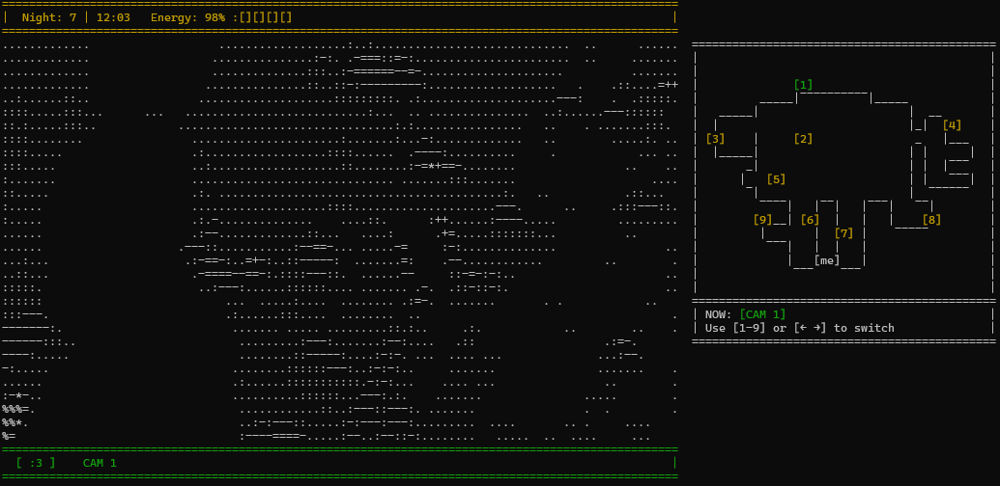
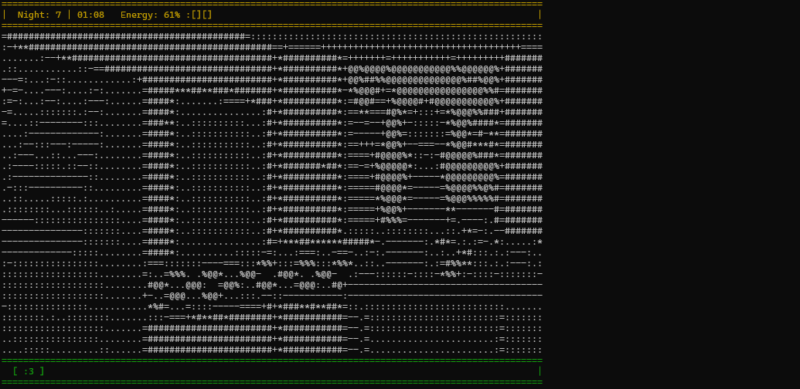

# 🕹️ Terminal FNaF

**Terminal FNaF** — is a terminal game inspired by the original *Five Nights at Freddy's* series. The player has to survive the night in the security room, watching the animatronics and controlling the doors and lights to prevent them from getting in.


*Watch the chimeras through the cameras...*


*Close the door before it's too late...*

---

## 📦 Installation

### 🔧 Requirements

- Python **3.8 or newer**
- Library `curses`  
  - **Linux/macOS**: set by default
  - **Windows**: install via pip:
    ```bash
    pip install windows-curses
    ```

### 📥 Cloning a repository

```bash
git clone https://github.com/Lonja971/Terminal-FNaF.git
cd Terminal-FNaF
```

### ▶️ Launching the game

```bach
python main.py
```

## 🎮 Control

| Key     | Action                           |
| ------- | -------------------------------- |
| `A`     | Move the view to the left        |
| `D`     | Move the view to the right       |
| `K`     | Turn on/off the light            |
| `L`     | Open/close the door              |
| `SPACE` | Open/close cameras               |
| `1`–`9` or `←` `→` or `k` `l` | Switch to the appropriate camera |
| `P`     | Pause                            |
| `Q x2`     | Exit the game                    |

## 🧠 Gameplay

- Monitor your animatronics with cameras.
- Each action (doors, lights, cameras) consumes energy.
- If the animatronic reaches the room and the door is open, the game is over.
- Survive the night from 12:00 AM to 6:00 AM to win.

## ⚠️ Notes

- The terminal must support at least 170/40 characters for the correct display of the interface.
- It is recommended to run the game in half screen mode for the best experience (Related to symbolic graphics).

## Authors

- [@Lonja971](https://github.com/Lonja971)

P.S. I’ve poured my heart and soul into this project.
Thank you for your attention and support!